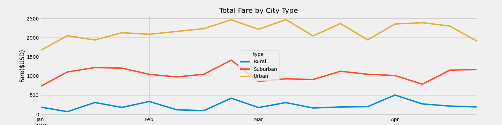

## Overview of Project :

We analysed data-set from a variety of sources and formats to informed decision-makers of PyBer company. 
We aggregated datas to showcase the total weekly fares for different cities type. The question here is how could we make the ride sharing more efficient in each cities type we encounter based on the datas we analysed. 

## Results :
 
For this work, we analyse 6 ride-sharing metrics, and their impact on the total weekly fare for each cities type (Rural, Urban and Suburban): 

- Total rides: 
  We analysed that there is a lot of disparities in the total rides in each type of city. Rural cities had a low amount of rides, Suburban had 500 more rides and Urban got the most rides far ahead from the others cities type. 
 

- Total drivers: 
Urban cities got the most driver count in comparison of the others cities type, ~80% more than the Suburban and ~97% more than Rural. 

- Total fares: 
Urban cities got the more fare amount compared to other cities types, Suburban total fare was ~50% less of Urban and Rural was the lowest with ~90% less than the total fare for the most profitable cities type. 

- Average fare per ride:  
At a glance we saw that the average fare per ride is more expansive in the Rural cities type, Suburban were ~12% lower and Urban were the lower with an average fare of $24.52. 

- Average fare per driver: 
The average fare per driver reached is most for the Rural cities types and is lowest for the Urban, meanwhile, Suburban were in the middle closest to Rural. 

 
Finally the results showed that the average fare was bigger in Rural cities due to the fact that there were less driver available. The largest the city was, the more we could see ride-sharing. We also analysed that for all cities type there was a spike of fare in the last week of february. 

##  Summary :

We could recommended based on this analysis: 

- Lowering the fare per driver for the Rural type.
- Lowering the price of ride for the Rural type to encouraged more utilisation of the service.
- Allocated more drivers on Rural zone, because the driver count is really low in comparison of others cities types. 
A limitation here was the time frame for the analysis. Checking datas on a all year of service could have give more informations on it.
   

 
